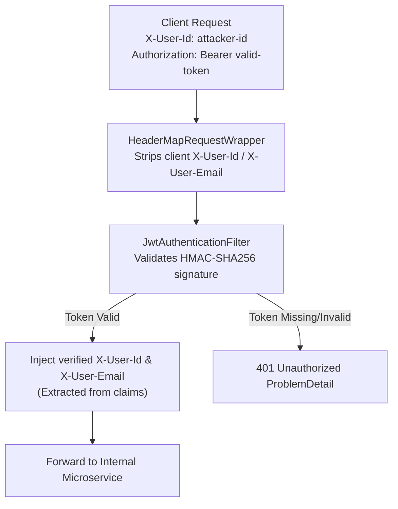

# API Gateway

The **API Gateway** (`com.subdual.api_gateway`) is the unified ingress entry point for all client traffic, acting as a reverse proxy, security boundary, and CORS manager.

---

## 1. Core Responsibilities

* **Unified Host Ingress**: In production, the Gateway (Port `9738`) is the sole backend port exposed to the public Internet or client browser.
* **Reverse Proxy Routing**: Maps API paths to internal microservices via Spring Cloud Gateway (WebMvc).
* **Cryptographic JWT Validation**: Validates HMAC-SHA256 Bearer tokens on protected endpoints, rejecting invalid tokens with RFC 7807 401 Unauthorized responses.
* **Anti-Spoofing Header Normalization**: Strips any client-supplied identity headers, injecting cryptographically verified headers downstream.
* **Centralized CORS & Security Headers**: Manages preflight requests for the Next.js frontend and injects standard security headers.

---

## 2. Ingress Routing Table

| Ingress Path Pattern | Destination Microservice | Internal Address | Purpose |
| :--- | :--- | :--- | :--- |
| `/api/v1/auth/**` | `auth-service` | `http://auth-service:9739` | Registration, login, token issuance, user profile |
| `/api/v1/enrichment/**` | `dataset-service` | `http://dataset-service:9743` | Batch dataset enrichment jobs & SSE streaming |
| `/api/v1/entities/**` | `dataset-service` | `http://dataset-service:9743` | Persisted entity catalog, sources, and attributes |
| `/api/v1/research/**` | `research-service` | `http://research-service:9741` | Synchronous & async web research pipelines |
| `/api/v1/sources/**` | `research-service` | `http://research-service:9741` | Discovered source inspection and verification |
| `/api/v1/ai/**` | `ai-intelligent-service` | `http://ai-intelligent-service:9742` | Requirement parsing, data cleansing, LLM grounding |
| `/actuator/**` | Local Gateway | Localhost:9738 | Gateway health and runtime status |

---

## 3. Anti-Spoofing Security Architecture

External clients cannot impersonate users by passing arbitrary header values:

### Whitelisted Public Endpoints
The following paths bypass JWT Bearer verification:
* `POST /api/v1/auth/register`
* `POST /api/v1/auth/login`
* `/actuator/health` and `/actuator/info`
* HTTP `OPTIONS` requests (CORS preflight)

---

## 4. Injected Security Headers

Every HTTP response processed by the gateway includes:
* `X-Content-Type-Options: nosniff`
* `X-Frame-Options: DENY`
* `Referrer-Policy: strict-origin-when-cross-origin`
* `Permissions-Policy: geolocation=(), microphone=(), camera=()`
