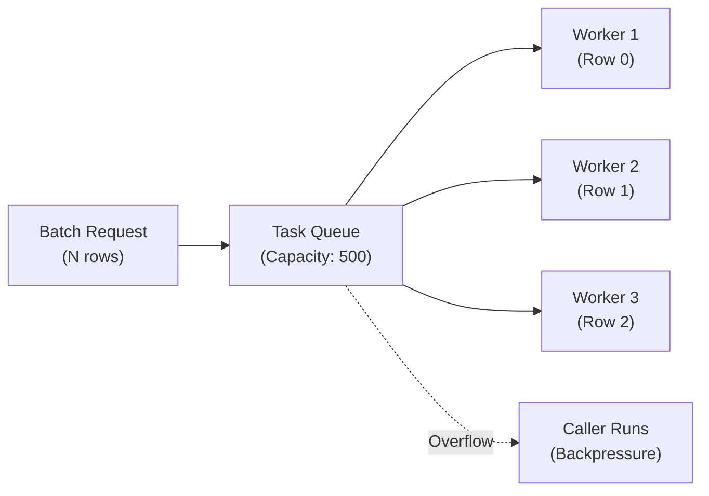

# Dataset Service: Internals & Engineering Deep Dive

This document details the internal design patterns, thread execution models, client resilience, and relational data strategies inside `dataset-service`.

---

## 1. Bounded Concurrency (`EnrichmentTaskExecutorConfig`)

Sequential dataset processing is unacceptably slow, but unbounded thread spawning risks thread starvation, out-of-memory errors, and rate-limiting from external search APIs.

### ThreadPoolTaskExecutor Architecture
* **Bean Name**: `enrichmentTaskExecutor`
* **Core Pool Size**: 3 (configurable via `enrichment.concurrency.workers: 3`)
* **Max Pool Size**: 10
* **Queue Capacity**: 500 tasks
* **Thread Name Prefix**: `dataset-enrichment-worker-`
* **Rejection Policy**: `ThreadPoolExecutor.CallerRunsPolicy`



When the 500-item queue fills up, `CallerRunsPolicy` forces the submitting thread to execute the row task directly, throttling new submissions until the worker pool recovers.

---

## 2. Real-Time Observability via Server-Sent Events (SSE)

### In-Memory Replay Buffer
To provide seamless UX during network reconnection or page refreshes, `dataset-service` maintains an in-memory replay buffer:
* **Capacity**: Last 500 events per job.
* **Storage**: Thread-safe bounded buffer (`ConcurrentLinkedQueue` or synchronized list).
* **Handshake Sequence**:
  1. Client connects to `GET /api/v1/enrichment/jobs/{jobId}/events`.
  2. The service sends an immediate `init` event containing `jobId`, `totalRows`, and active worker concurrency.
  3. Replays all historical buffered events in sequence, allowing the client's `LiveExecutionDashboard` to reconstruct current worker cards immediately.
  4. Keeps the `SseEmitter` open for live event streaming.

---

## 3. Inter-Service Communication via `RestClient`

The service delegates research and intelligence to downstream microservices using Spring 6's synchronous `RestClient`.

### A. Distributed MDC Tracing (`CorrelationIdClientInterceptor`)
Every HTTP call attaches the `X-Correlation-ID` header. If an MDC trace does not exist, a new UUID is generated and bound. Downstream services (`research-service` and `ai-intelligent-service`) log using this identifier:

```java
@Bean
public RestClient restClient(RestClient.Builder builder, CorrelationIdClientInterceptor interceptor) {
    return builder
            .requestInterceptor(interceptor)
            .build();
}
```

### B. Dependency Resilience & Degradation
* **`ResearchServiceClient` (Hard Dependency)**:
  - Invokes `POST /api/v1/research`.
  - No fallback: Web evidence is mandatory. If `research-service` is unreachable or times out, the row status is set to `FAILED`.
* **`AiServiceClient` (Soft Dependency)**:
  - Invokes `POST /api/v1/ai/requirement`, `/clean`, `/enrich`, `/profile/assess`.
  - Resilient fallback: If the AI service is unreachable or rate-limited, raw research tuples are extracted directly without LLM transformation, and the row status is marked `AI_DEGRADED`.

| Status | Meaning | Action Taken |
| :--- | :--- | :--- |
| `COMPLETED` | Both research and AI succeeded. | Full evidence, attributes, and fit assessment persisted. |
| `AI_DEGRADED` | Research succeeded, AI failed/timed out. | Raw research tuples populated directly without LLM synthesis. |
| `PARTIAL` | Research succeeded, some fields missing. | Found fields populated; missing fields set to `UNKNOWN`. |
| `INSUFFICIENT_EVIDENCE`| Research found no authoritative sources. | Basic entity recorded with attributes set to `UNKNOWN`. |
| `FAILED` | Connection failure to research service. | Row marked failed; remaining rows continue uninterrupted. |

---

## 4. Relational Persistence & Flyway Migrations

Persistence is managed using Spring Data JPA backed by versioned Flyway migrations:

1. **`V1__init_schema.sql`**: Creates `entities`, `entity_sources`, and `entity_attributes` tables.
2. **`V2__add_indexes.sql`**: Adds composite indexes for query performance (`idx_entities_type`, `idx_attributes_key`).
3. **`V3__add_user_id.sql`**: Adds nullable `user_id VARCHAR(36)` to `entities` for user-scoped multi-tenancy.

### Idempotent Snapshot Upserts
In `EntityRecord`:

```java
@OneToMany(mappedBy = "entity", cascade = CascadeType.ALL, orphanRemoval = true)
private List<EntitySourceRecord> sources = new ArrayList<>();

@OneToMany(mappedBy = "entity", cascade = CascadeType.ALL, orphanRemoval = true)
private List<EntityAttributeRecord> attributes = new ArrayList<>();
```

When re-enriching an existing `entityId`, the service replaces the child collections. Hibernate executes atomic deletes of old attributes and inserts the new evidence within a single `@Transactional` boundary, preventing duplicate records or orphaned foreign keys.

---

## 5. Developer Patterns

### Type-Safe Configuration (`@ConfigurationProperties`)
Rather than spreading `@Value` annotations across services, configuration is centralized in `@ConfigurationProperties` classes:
* `EnrichmentTaskExecutorConfig` binds `enrichment.concurrency.*`.
* Binds defaults with type safety and validation at application startup.

### Interface `default` Compatibility Pattern
As requirements evolve (e.g. introducing `userId` scoping), Java interface `default` methods allow backward compatibility without breaking existing callers or unit tests:

```java
public interface DatasetEnrichmentService {
    default EnrichmentJob getJob(String jobId) {
        return getJob(jobId, null);
    }
    EnrichmentJob getJob(String jobId, String userId);
}
```
