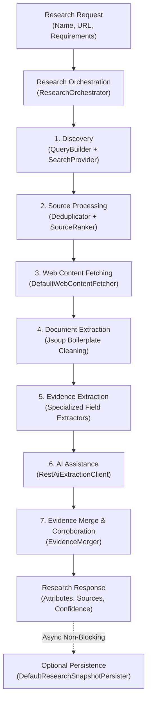

# Research Service

The **Research Service** (`com.subdual.research_service`) coordinates autonomous web discovery, content fetching, boilerplate cleaning, verbatim evidence compilation, and multi-source corroboration for target entities.

---

## 1. Core Responsibilities

* **Core Principle**: *"Research produces evidence."*
* **Autonomous Exploration**: LLMs cannot browse the web directly. This service treats input names and URLs as research seeds, formulates requirement-aware search queries, fetches web pages, and compiles factual evidence before triggering AI extraction.
* **Provider Decoupling**: Abstracts web search behind the `SearchProvider` interface (Tavily search provider with offline `MockSearchProvider` fallback).
* **Defensive Web Crawling**: Enforces strict timeouts, buffer caps, and anti-bot degradation fallbacks (falling back to search engine snippets when direct scraping is blocked).
* **Multi-Source Corroboration**: Evaluates claims across multiple sources, boosts confidence when independent domains agree, and flags conflicting information.

---

## 2. Key Capabilities & Endpoints

| Method | Path | Description | Public / Auth |
| :--- | :--- | :--- | :--- |
| `POST` | `/api/v1/research` | Executes synchronous end-to-end research for an entity. | Internal / Auth |
| `POST` | `/api/v1/research/jobs` | Submits an asynchronous background research job. | Internal / Auth |
| `GET` | `/api/v1/research/jobs/{jobId}` | Polls the status and result of an asynchronous research job. | Internal / Auth |
| `GET` | `/actuator/health` | Service health status probe (`UP`). | Public |

---

## 3. High-Level Research Pipeline



---

## 4. Package Organization

The service follows a feature-first, cohesive subsystem architecture:

```
com.subdual.research_service
├── api/                                          # Public REST layer
│   ├── controller/
│   │   └── ResearchController.java
│   ├── dto/
│   │   ├── request/
│   │   │   └── ResearchRequest.java
│   │   └── response/
│   │       ├── EvidenceTuple.java
│   │       ├── ResearchJobResponse.java
│   │       ├── ResearchResponse.java
│   │       ├── ResearchResult.java
│   │       └── SourceItem.java
│   └── validation/
│       └── ResearchRequestValidator.java
│
├── research/                                     # Core research orchestration & pipeline
│   ├── service/
│   │   ├── ResearchService.java
│   │   └── impl/ResearchOrchestrator.java
│   ├── pipeline/
│   │   ├── EntityNormalizer.java
│   │   ├── DefaultEntityNormalizer.java
│   │   ├── SourceProcessor.java
│   │   ├── RelevanceEvaluator.java
│   │   ├── SourceClassifier.java
│   │   ├── ResearchResponseFactory.java
│   │   └── ResearchDiagnostics.java
│   ├── model/ (ResearchTarget, ResearchSource, DiscoveredSource, etc.)
│   └── job/ (ResearchJobService, InMemoryResearchJobService, ResearchJob)
│
├── discovery/                                    # Subsystem 1: Search & candidate discovery
│   ├── service/
│   │   ├── ResearchDiscoveryService.java
│   │   ├── impl/DefaultResearchDiscoveryService.java
│   │   └── helper/QueryBuilder.java
│   ├── provider/ (SearchProvider, TavilySearchProvider, MockSearchProvider)
│   ├── ranking/ (SourceRanker, SourceDeduplicator, SourceTypeClassifier)
│   └── cache/ThreadSafeSourceCache.java
│
├── extraction/                                   # Subsystem 2: Evidence extraction & normalization
│   ├── service/
│   │   ├── SourceEvidenceService.java
│   │   └── impl/DefaultSourceEvidenceService.java
│   ├── extractor/
│   │   ├── EvidenceExtractor.java
│   │   ├── CommonEvidenceExtractor.java
│   │   └── field/ (Role, Org, Experience, Education, Skill, TechFieldExtractor)
│   ├── ai/AiEvidenceEnricher.java
│   ├── document/ContentExtractor.java
│   └── support/ (EntityResolver, EvidenceMerger, FuzzyMatcher, NameNormalizer)
│
├── integration/                                  # Subsystem 3: Inter-service boundaries
│   ├── ai/
│   │   ├── client/ (AiExtractionClient, RestAiExtractionClient, NoOpAiExtractionClient)
│   │   └── dto/ (AiExtractionRequest, AiExtractionResponse, AiExtractedFact)
│   ├── persistence/
│   │   ├── client/ (DatasetPersistenceClient, RestDatasetPersistenceClient)
│   │   ├── dto/ (PersistEntityRequest, EntityAttributeDto, EntitySourceDto)
│   │   └── DefaultResearchSnapshotPersister.java
│   └── web/ (WebContentFetcher, DefaultWebContentFetcher, FetchedContent)
│
├── common/ (exception, filter)
├── config/ (ResearchDiscoveryProperties, ResearchPipelineProperties, ServiceMeshProperties)
└── util/UrlNormalizer.java
```

For detailed algorithmic flows (including `QueryBuilder` strategies, crawler defenses, and corroboration logic), see **[Research Service Internals](internals.md)**.
