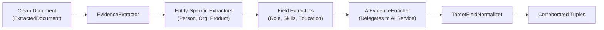

# Research Service: Internals & Engineering Deep Dive

This document details the internal heuristics, search adapters, defensive crawling mechanics, and evidence corroboration algorithms within `research-service`.

---

## 1. Requirement-Aware Query Construction (`QueryBuilder`)

A naive search for an entity name (e.g. `"John Smith"`) returns noisy, irrelevant search results. `QueryBuilder` formulates multi-strategy, context-aware queries:

### Query Strategies
1. **Primary Canonical Query**: Combines entity name with anchor profile domain (e.g. `site:linkedin.com/in/ "Linus Torvalds"`).
2. **Contextual Disambiguation**: When an anchor URL is missing, anchors the entity using known organization, location, or professional role (e.g. `"Guido van Rossum" Microsoft "Distinguished Engineer"`).
3. **Requirement-Specific Query**: Maps user requirements into targeted keyword queries (e.g. `"Satya Nadella" Microsoft education university degree`).
4. **Adaptive Gap Closing**: If initial discovery leaves critical fields missing, `discoverAdaptiveSources()` builds targeted secondary queries to fill specific information gaps.

---

## 2. Defensive Web Crawling & SSRF Protection

Web crawling untrusted URLs poses severe operational and security risks:
* **Server-Side Request Forgery (SSRF)**: Validates destination hosts against private IP ranges (`127.0.0.1`, `10.0.0.0/8`, `192.168.0.0/16`, AWS/GCP metadata endpoints).
* **Connection & Read Timeouts**: Strictly caps socket connection and read operations at **5,000ms**.
* **Buffer Limiting**: Enforces a **500KB content limit**. Excess bytes are discarded to prevent memory exhaustion from oversized downloads.
* **Anti-Bot Snippet Fallback**: If target sites return anti-bot status codes (HTTP 403, 429, or Cloudflare HTTP 999), the fetcher gracefully degrades by extracting evidence from the search provider's index snippet rather than failing.

---

## 3. Evidence Extraction & Normalization

Evidence collection combines rule-based extractors with AI assistance:

### Specialized Field Extractors (`extraction/extractor/field/`)
* **`RoleFieldExtractor`**: Detects professional headlines and titles.
* **`OrganizationFieldExtractor`**: Identifies employers, subsidiaries, and corporate entities.
* **`EducationFieldExtractor`**: Identifies universities, degrees, and graduation years.
* **`TechFieldExtractor` & `SkillFieldExtractor`**: Identifies programming languages, cloud platforms, and frameworks.

---

## 4. Multi-Source Corroboration Engine (`EvidenceMerger`)

When multiple sources provide claims about the same attribute, `EvidenceMerger` evaluates provenance:

### Confidence Tier Elevation
1. **Single Source**: If only one domain makes a claim, the attribute is assigned `LOW` confidence (or `MEDIUM` if from an authoritative primary domain).
2. **Independent Corroboration**: If two or more independent second-level domains agree on the same value, confidence is boosted to `HIGH`.
3. **Conflict Detection**: If independent sources state conflicting values (e.g. Source A says `"VP Engineering"` while Source B says `"Chief Technology Officer"`):
   - Sets `conflictDetected = true`.
   - Records all conflicting claims and corroborating URLs in an audit trail.
   - Assigns priority to the primary authoritative domain.

---

## 5. Resilient Inter-Service Integration

* **AI Extraction (`RestAiExtractionClient`)**:
  - Delegates fact extraction to `ai-intelligent-service` via `POST /api/v1/ai/extract`.
  - Wrapped with connection timeouts. If the AI service is offline, falls back to local regex extractors.
* **Non-Blocking Persistence (`DefaultResearchSnapshotPersister`)**:
  - Asynchronously notifies `dataset-service` of research findings via `POST /api/v1/entities`.
  - Persistence failures record a diagnostic warning but **never fail** an active research pipeline execution.
