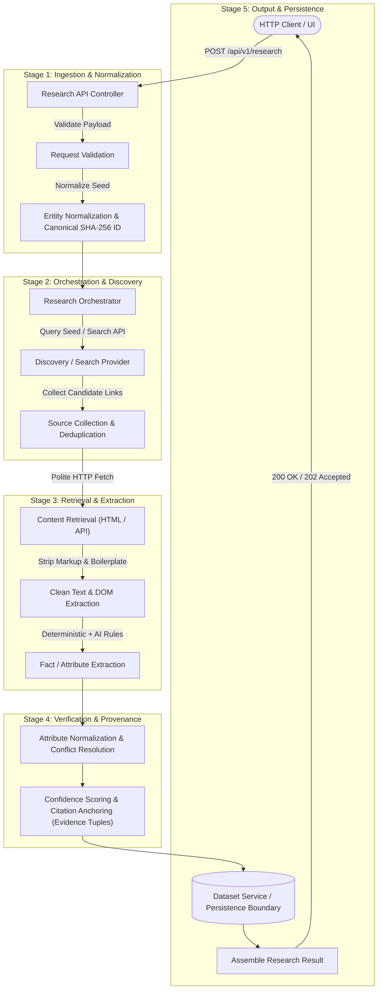
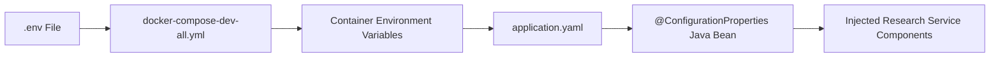
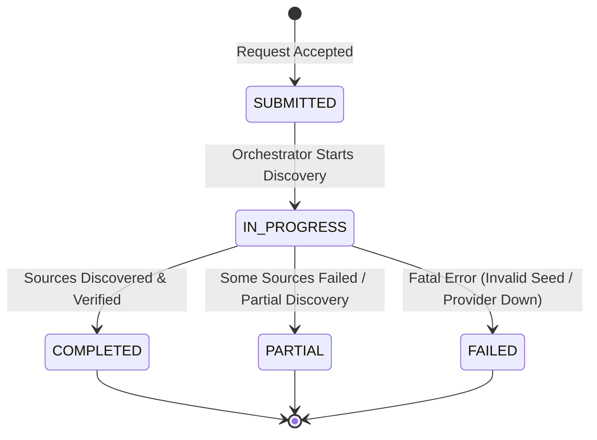

# Research Service: Target Pipeline & Next Development Workflow

> **Document Type:** Architecture Roadmap & Technical Specification  
> **Target Component:** `apps/backend/research-service`  
> **Current Milestone:** Phase 1 Completed &rarr; Phase 2 (Polite Content Retrieval) Next  
> **Last Updated:** 2026-09-05  

---

## Executive Summary

The **Data Enrichment AI Intelligence Platform** transforms sparse entity records (URLs, names, basic identifiers) into rich, verified, structured, and AI-scored data assets.

This document establishes the production-oriented technical roadmap for transitioning the **Research Service** from its current baseline (a validated HTTP endpoint returning empty results) into an operational web discovery, retrieval, and enrichment pipeline. It defines:
* The current state and its precise limitations.
* The end-to-end target research pipeline.
* The immediate next vertical slice (**Phase 1: Web Discovery**).
* A 7-phase staged delivery roadmap.
* Configuration flow, domain models, error handling, security boundaries, and testing strategies.
* Explicit boundaries regarding what will **not** be built yet.
* An actionable checklist for the next implementation phase.

---

## 1. Current State Baseline

### What Currently Works

The foundation for the local development environment and the initial Research Service API is operational:

```text
HTTP Client (Postman / cURL)
          │
          ▼  POST /api/v1/research (application/json)
   [ResearchController] ──► Validates payload (@Valid, @NotBlank, @Pattern, EntityType)
          │
          ▼  ResearchRequest(url, entityType, name)
[DefaultResearchService] ──► Canonicalizes URL (scheme/host lowercased, default ports removed)
          │             ──► Computes deterministic entityId (SHA-256 hash)
          │             ──► Assembles ResearchResult (displayName, type, canonicalUrl, empty attributes)
          ▼
   [ResearchResponse]   ──► status: COMPLETED, sources: [], executionTimeMs: ~2ms
```

1. **Dockerized Environment:** The local multi-container stack (`docker-compose-dev-all.yml`) starts without errors, provisioning MySQL (`3306`), Research Service (`9741`), AI Intelligent Service (`9742`), Dataset Service (`9743`), and Next.js Frontend (`3000`).
2. **HTTP API & Content Negotiation:** `POST /api/v1/research` in `ResearchController` strictly enforces media type contracts using `consumes = MediaType.APPLICATION_JSON_VALUE` and `produces = MediaType.APPLICATION_JSON_VALUE`.
3. **Request Validation:** Incoming payloads are validated via Jakarta Bean Validation:
   * `url`: Must be non-blank and conform to a well-formed HTTP/HTTPS regex pattern (`@Pattern`).
   * `entityType`: Deserialized to the `EntityType` enum (`PERSON`, `ORGANIZATION`, `PRODUCT`, `REPOSITORY`, `WEBSITE`, `OTHER`), defaulting to `OTHER` when omitted.
   * `name`: Optional display name hint.
4. **RFC 7807 Error Handling:** `GlobalExceptionHandler` intercepts validation failures (`MethodArgumentNotValidException`, `HttpMessageNotReadableException`, `IllegalArgumentException`) and returns standardized RFC 7807 `ProblemDetail` structures with status `400 Bad Request`.
5. **Deterministic Normalization Scaffold:**
   * `DefaultResearchService` canonicalizes input URLs (lowercasing host/scheme, standardizing paths).
   * Generates a 64-character hex SHA-256 hash from the canonical URL to serve as the immutable `entityId`.
   * Sets fallback `displayName` to the canonical URL if `name` is blank or omitted.
6. **Automated & Manual Verification:**
   * Unit and controller slice tests (`ResearchControllerTest`, `DefaultResearchServiceTest`) pass with 100% assertions satisfied.
   * Manual verification via Postman successfully confirmed the `200 OK` structure and `400 Bad Request` edge cases.

### Honest Baseline: What Does NOT Exist Yet

To ensure technical clarity, the current code intentionally contains the following stubs:

* **No Web Discovery:** No external search engine or registry API is queried.
* **Empty Sources:** `sources[]` returns an empty array (`List.of()`).
* **Empty Attributes:** `result.attributes{}` returns an empty map (`Map.of()`).
* **Status Caveat:** The current `ResearchStatus.COMPLETED` status indicates only that the synchronous in-memory request-response cycle executed without exception. It does **not** indicate that the entity was discovered or enriched.
* **Zero Persistence:** No entity, job, or evidence data is stored in MySQL; execution is strictly ephemeral.

---

## 2. Target Research Pipeline

The complete research and enrichment pipeline transforms an initial entity seed into verified, structured intelligence across a series of decoupled stages.

### Target Architecture Flow



### Detailed Pipeline Stages

| Stage | Name | Description | Output Artifact |
| :--- | :--- | :--- | :--- |
| **1** | **Request Validation** | Enforces URL formatting, protocol scheme (`http`/`https`), and entity hints. Rejects malformed input early with RFC 7807 `ProblemDetail`. | Validated `ResearchRequest` |
| **2** | **Entity Normalization** | Strips tracking query parameters (`utm_*`, `ref`), lowercases scheme and host, normalizes trailing slashes, and computes deterministic SHA-256 `entityId`. | Canonical URL & `entityId` |
| **3** | **Research Orchestrator** | Coordinates discovery strategies based on `entityType` (e.g., repository lookup vs. company domain discovery vs. person profile). | Research Execution Plan |
| **4** | **Discovery / Search** | Queries public search providers or developer APIs to identify relevant web pages, documentation, or public profiles. | Discovered candidate URLs with search snippets |
| **5** | **Source Collection & Deduplication** | Filters low-relevance links, normalizes discovered URLs, and removes duplicates. | Deduplicated `List<DiscoveredSource>` |
| **6** | **Content Retrieval** | Polite HTTP client fetches page content with strict connection/read timeouts, redirect guards, and payload size caps. | Raw HTML / JSON payload & HTTP status |
| **7** | **Content Extraction** | Strips HTML boilerplate, navigation, and script tags to extract clean readable text and structured metadata (OpenGraph, meta tags). | Clean Text & Meta Tags |
| **8** | **Fact / Attribute Extraction** | Combines deterministic parsers (for dates, licenses, repository stats) with AI-assisted structured extraction (for roles, summaries, affiliations). | Unverified candidate facts |
| **9** | **Normalization & Deduplication** | Resolves conflicting facts across sources and maps extracted attributes to the canonical domain schema. | Structured attribute candidates |
| **10** | **Confidence & Provenance** | Binds every attribute to an exact source URL, verbatim text quote, and confidence tier (`HIGH`, `MEDIUM`, `LOW`, `UNKNOWN`). | `Map<String, EvidenceTuple>` |
| **11** | **Persistence Boundary** | Relays enriched entity data, discovered sources, and provenance logs to `dataset-service` for long-term storage. | Persisted Entity & Audit Log |
| **12** | **Response Assembly** | Compiles the final `ResearchResponse` containing entity metadata, verified attributes, discovered sources, and execution metrics. | HTTP JSON Response |

---

## 3. Next API to Implement: Phase 1 Vertical Slice

### Objective of the Next Slice

The immediate goal is **not** to build the entire autonomous crawler or complete AI extraction loop.

> **Phase 1 Goal:**  
> *Given a valid entity URL and classification hint, query a search/discovery provider, collect useful public web sources, deduplicate and score them, and return the populated source list with metadata.*

### Endpoint Definition

* **Endpoint:** `POST /api/v1/research`
* **Method:** `POST`
* **Headers:** `Content-Type: application/json`, `Accept: application/json`

#### Inbound Request Payload

```json
{
  "url": "https://github.com/spring-projects/spring-boot",
  "entityType": "REPOSITORY",
  "name": "Spring Boot"
}
```

#### Proposed Next Response Payload (Phase 1 Target)

```json
{
  "status": "COMPLETED",
  "entityId": "a1b2c3d4e5f67890123456789abcdef0123456789abcdef0123456789abcdef",
  "result": {
    "displayName": "Spring Boot",
    "entityType": "REPOSITORY",
    "canonicalUrl": "https://github.com/spring-projects/spring-boot",
    "attributes": {}
  },
  "sources": [
    {
      "url": "https://github.com/spring-projects/spring-boot",
      "title": "spring-projects/spring-boot: Spring Boot helps you create Spring-powered applications",
      "sourceType": "GITHUB",
      "retrievedAt": "2026-09-05T06:45:00Z",
      "relevance": 1.00
    },
    {
      "url": "https://spring.io/projects/spring-boot",
      "title": "Spring Boot - Overview and Quickstart",
      "sourceType": "OFFICIAL_WEBSITE",
      "retrievedAt": "2026-09-05T06:45:01Z",
      "relevance": 0.95
    },
    {
      "url": "https://docs.spring.io/spring-boot/docs/current/reference/html/",
      "title": "Spring Boot Reference Documentation",
      "sourceType": "DOCUMENTATION",
      "retrievedAt": "2026-09-05T06:45:01Z",
      "relevance": 0.90
    }
  ],
  "executionTimeMs": 412
}
```

#### Domain Model Alignment

The existing Java record in the codebase is:

```java
// Current com.subdual.research_service.dto.SourceItem
public record SourceItem(
    String url,
    Instant retrievedAt,
    String sourceType
) {}
```

In Phase 1, `SourceItem` will be enhanced to carry descriptive metadata without breaking the existing contract structure:

```java
// Target com.subdual.research_service.dto.SourceItem (Phase 1 Enhancement)
public record SourceItem(
    String url,
    String title,
    String sourceType,
    Instant retrievedAt,
    Double relevance
) {}
```

---

## 4. Phased Development Roadmap

```mermaid
gantt
    title Research Service Development Roadmap
    dateFormat  YYYY-MM-DD
    section MVP / Current
    Phase 0 : Foundation & Scaffold         :done, p0, 2026-09-01, 2026-09-04
    section Next Phase
    Phase 1 : Web Source Discovery          :active, p1, 2026-09-05, 2026-09-12
    section Planned Milestones
    Phase 2 : Polite Content Retrieval      :p2, 2026-09-13, 2026-09-20
    Phase 3 : Fact & Attribute Extraction   :p3, 2026-09-21, 2026-09-28
    Phase 4 : Provenance & Confidence Tiers :p4, 2026-09-29, 2026-10-06
    Phase 5 : Dataset Service Persistence   :p5, 2026-10-07, 2026-10-14
    Phase 6 : Asynchronous Job Execution    :p6, 2026-10-15, 2026-10-22
    Phase 7 : Cross-Service Mesh Integration:p7, 2026-10-23, 2026-10-30
```

### Phase 1 — Web Discovery (Immediate Target)

* **Objective:** Query an external search provider or discovery client to locate relevant public URLs related to the seed entity.
* **Flow:**
  `ResearchRequest` &rarr; Validation &rarr; URL Canonicalization &rarr; Search Query Construction &rarr; Search Execution &rarr; URL Deduplication & Filtering &rarr; Return `sources[]` with metadata.
* **Key Tasks:**
  * Define `SourceDiscoveryProvider` interface.
  * Implement query formation based on seed URL host, name, and `entityType`.
  * Deduplicate URLs (discard duplicate domains or duplicate paths).
  * Classify source types (`OFFICIAL_WEBSITE`, `GITHUB`, `DOCUMENTATION`, `SEARCH_RESULT`, `OTHER`).
  * Return populated `sources[]` in `ResearchResponse`.

### Phase 2 — Content Retrieval (Polite HTTP Fetching)

* **Objective:** Safely fetch readable content from discovered URLs without risking server stability or blocking.
* **Flow:**
  Discovered URL &rarr; SSRF / Domain Validation &rarr; Polite HTTP GET &rarr; Content-Type Check &rarr; HTML Parsing & Boilerplate Stripping &rarr; Plain Text Extraction & Raw Snippets.
* **Critical Operational Constraints:**
  * **Timeouts:** Connect timeout &le; 3 seconds; Read timeout &le; 5 seconds.
  * **Redirects:** Follow max 3 redirects; prevent redirecting from public to private IP addresses.
  * **Content-Type Filter:** Only accept `text/html`, `text/plain`, `application/json`. Reject images, audio, video, and PDFs (&gt; 2 MB).
  * **Max Response Size:** Stream truncation at 2 MB to protect JVM memory.
  * **Politeness & Rate Limits:** Domain-level rate limiting (max 1 request/sec per remote host), user-agent header identification.
  * **Failure Isolation:** Non-200 responses or timeouts on individual sources must not abort the overall research job.

### Phase 3 — Attribute Extraction (Deterministic + AI)

* **Objective:** Extract structured entity attributes from retrieved text content.
* **Flow:**
  Clean Text &rarr; Deterministic Extraction (regex, meta tags, schema.org JSON-LD) &rarr; AI Structured Extraction (Spring AI ChatClient) &rarr; Normalized Candidate Attributes.
* **Separation of Extraction Responsibilities:**
  * **Deterministic Extraction:** Repository stars, license names, OpenGraph titles, meta descriptions, publication dates. Highly accurate, instantaneous, zero cost.
  * **AI-Assisted Extraction:** Disambiguating complex biographies, extracting company headquarters from informal paragraphs, categorizing industry verticals, summarizing core value propositions. Executed via `ai-intelligent-service`.

### Phase 4 — Provenance & Confidence Tiers

* **Objective:** Enforce zero-hallucination compliance by attributing every asserted field to an empirical citation.
* **The Evidence Tuple Pattern:**

```text
Extracted Attribute
├── fieldName: "license"
├── value: "Apache-2.0"
├── sourceUrl: "https://github.com/spring-projects/spring-boot"
├── evidenceSnippet: "Spring Boot is Open Source software released under the Apache 2.0 license."
├── confidence: HIGH
├── retrievedAt: "2026-09-05T06:45:00Z"
└── extractionMethod: DETERMINISTIC_METADATA
```

* **Zero-Hallucination Policy:** If an attribute cannot be found in retrieved text snippets:
  * `value` is set to `"UNKNOWN"`.
  * `sourceUrl` is set to `null`.
  * `evidenceSnippet` is set to `null`.
  * `confidence` is set to `ConfidenceTier.UNKNOWN`.

### Phase 5 — Persistence Boundary

* **Objective:** Save research requests, discovered sources, and verified attributes across sessions.
* **Design Boundary:**
  * `research-service` remains stateless and does not directly connect to MySQL.
  * Research results are passed via REST client to `dataset-service` (Port 9743).
  * `dataset-service` writes entities, source audit logs, and attribute values into relational tables using Spring Data JPA.

### Phase 6 — Asynchronous Research & Job Polling

* **Objective:** Decouple long-running multi-source research (5–30 seconds) from HTTP request threads.
* **Flow:**

```text
Client ──► POST /api/v1/research ──► 202 Accepted { "jobId": "job-8812", "status": "SUBMITTED" }
                                            │
                                            ▼ (Background Task Execution)
Client ──► GET /api/v1/research/jobs/job-8812 ──► 200 OK { "jobId": "job-8812", "status": "IN_PROGRESS", "progress": 40 }
                                            │
                                            ▼ (Upon Completion)
Client ──► GET /api/v1/research/jobs/job-8812 ──► 200 OK { "jobId": "job-8812", "status": "COMPLETED", "result": { ... } }
```

* **Rationale for Job Endpoint Naming:** `GET /api/v1/research/jobs/{jobId}` clearly differentiates between the execution job lifecycle and the resulting entity resource.

### Phase 7 — Cross-Service Integration & Mesh

* **Objective:** Formalize service boundaries and inter-service communication.
* **Service Responsibility Matrix:**

| Service | Primary Responsibilities | Dependencies |
| :--- | :--- | :--- |
| **Research Service** (`:9741`) | Orchestration, URL discovery, polite HTTP retrieval, source deduplication, evidence compilation. | WebMvc, Validation, Actuator |
| **AI Intelligent Service** (`:9742`) | Spring AI ChatClient, prompt engineering, structured extraction, LLM evaluation, scoring. | WebMvc, Spring AI GenAI Starter |
| **Dataset Service** (`:9743`) | Ingestion of tabular datasets (CSV/JSON), MySQL JPA persistence, entity query, export generation. | WebMvc, JPA, MySQL Driver |
| **Frontend** (`:3000`) | User interface for submitting single entities or batch files, monitoring job progress, and inspecting evidence citations. | Next.js, React, Tailwind |

---

## 5. External Integrations & Configuration

### Phase 1 Configuration (Required Immediately)

For Phase 1 Web Discovery, the service requires search provider configuration.

| Property / Env Variable | Default / Example Value | Description |
| :--- | :--- | :--- |
| `SEARCH_PROVIDER_NAME` | `mock` / `tavily` / `google` | Active discovery provider implementation. |
| `SEARCH_PROVIDER_API_KEY` | *(Placeholder / Empty)* | API key for external search provider. |
| `SEARCH_PROVIDER_BASE_URL` | `https://api.tavily.com` | Base URL of the search service. |
| `SEARCH_DISCOVERY_MAX_RESULTS` | `5` | Maximum number of candidate sources to discover per query. |
| `SEARCH_DISCOVERY_TIMEOUT_MS` | `4000` | Timeout in milliseconds for search API requests. |

### Future Configurations (Phases 2–7)

| Category | Properties | Required Phase |
| :--- | :--- | :--- |
| **HTTP Retrieval** | `RETRIEVAL_CONNECT_TIMEOUT_MS`, `RETRIEVAL_READ_TIMEOUT_MS`, `RETRIEVAL_MAX_BYTES`, `RETRIEVAL_USER_AGENT` | Phase 2 |
| **Inter-Service** | `AI_INTELLIGENT_SERVICE_URL`, `DATASET_SERVICE_URL` | Phase 3, Phase 5 |
| **AI Provider** | `GEMINI_API_KEY`, `SPRING_AI_MODEL_NAME` | Phase 3 (`ai-intelligent-service`) |
| **Database** | `SPRING_DATASOURCE_URL`, `SPRING_DATASOURCE_USERNAME`, `SPRING_DATASOURCE_PASSWORD` | Phase 5 (`dataset-service`) |
| **Job Queue** | `RESEARCH_ASYNC_CORE_POOL_SIZE`, `RESEARCH_ASYNC_MAX_POOL_SIZE` | Phase 6 |

### Configuration File Locations

```text
Local Developer Machine (.env) ──[Ignored by Git, contains actual local keys]
          │
          ▼
Template (.env.example) ───────[Committed to Git, contains placeholder values only]
          │
          ▼
Docker Compose (docker-compose-dev-all.yml) ──[Maps environment variables into containers]
          │
          ▼
Application Config (application.yaml) ───────[Spring Boot placeholder binding with fallbacks]
```

> [!CAUTION]
> **Zero Secrets Policy:** Never commit actual API keys, passwords, or authentication tokens into source code, documentation, or Git history. Always use descriptive placeholder names (`SEARCH_PROVIDER_API_KEY`, `GEMINI_API_KEY`).

---

## 6. Configuration Flow Architecture

Application code must **never** call `System.getenv(...)` directly within business logic or service classes. Configuration must flow systematically through Spring Boot's type-safe configuration binding.

### Architecture Diagram



### Typed Configuration Example (Phase 1 Target)

```yaml
# apps/backend/research-service/src/main/resources/application.yaml
research:
  discovery:
    provider: ${SEARCH_PROVIDER_NAME:mock}
    api-key: ${SEARCH_PROVIDER_API_KEY:}
    base-url: ${SEARCH_PROVIDER_BASE_URL:https://api.tavily.com}
    max-results: ${SEARCH_DISCOVERY_MAX_RESULTS:5}
    timeout-ms: ${SEARCH_DISCOVERY_TIMEOUT_MS:4000}
```

```java
// Target configuration binding class
@ConfigurationProperties(prefix = "research.discovery")
public record ResearchDiscoveryProperties(
    String provider,
    String apiKey,
    String baseUrl,
    int maxResults,
    int timeoutMs
) {}
```

---

## 7. Conceptual Source Model

Sources represent external digital artifacts identified or inspected during research.

### Source Data Structure

```text
SourceItem
├── url: String (Canonical URL of the source)
├── title: String (Page title or headline)
├── sourceType: String / Enum (Classification of source authority)
├── retrievedAt: Instant (Timestamp of discovery/fetch)
├── relevance: Double (0.00 to 1.00 relevance score relative to entity seed)
├── httpStatus: Integer (HTTP status code, e.g. 200, 404 - Phase 2)
└── contentType: String (MIME type, e.g. text/html - Phase 2)
```

### Source Taxonomy

To prevent collisions with existing enums, sources are categorized using the following domain vocabulary:

| Source Type | Meaning | Example |
| :--- | :--- | :--- |
| `OFFICIAL_WEBSITE` | Primary domain, homepage, or verified organization website. | `https://spring.io` |
| `GITHUB` | Open-source repository, organization, or developer account. | `https://github.com/spring-projects` |
| `DOCUMENTATION` | Official user guide, reference manual, or API specification. | `https://docs.spring.io/spring-boot` |
| `SEARCH_RESULT` | Public search engine SERP link. | Search result from public query |
| `BLOG` | Technical article, blog post, or engineering whitepaper. | `https://spring.io/blog` |
| `SOCIAL_PROFILE` | Public directory or professional directory card. | Public speaker or directory profile |
| `OTHER` | Unclassified public web page. | Generic web resource |

---

## 8. Research Lifecycle & Status Semantics

To ensure unambiguous state representation across clients and background processes, research execution moves through explicit lifecycle states:



### State Definitions

| State | Lifecycle Stage | Semantic Meaning |
| :--- | :--- | :--- |
| `SUBMITTED` | Ingestion | Request received and validated; assigned an `entityId` or `jobId`. |
| `IN_PROGRESS` | Execution | Discovery, HTTP retrieval, or extraction actively executing. |
| `COMPLETED` | Success | Research completed successfully; sources discovered and verified. |
| `PARTIAL` | Graceful Degradation | Research completed with partial results (e.g., 2 of 4 sources succeeded, or some attributes could not be resolved). |
| `FAILED` | Fatal Error | Total failure; unresolvable URL, search provider offline, or internal runtime crash. |

> [!IMPORTANT]
> **Status Integrity Rule:** Do not return `COMPLETED` if discovery returned zero results due to an external failure or network disconnect. If partial evidence was collected, emit `PARTIAL`.

---

## 9. Error Handling & Partial Resilience

### HTTP Error Mapping

| HTTP Code | Error Condition | RFC 7807 Title | Detail Message Example |
| :--- | :--- | :--- | :--- |
| **400** | Malformed URL / Invalid EntityType | Bad Request | `Field 'url' must be a valid, well-formed HTTP/HTTPS URL` |
| **404** | Job ID or Entity ID not found | Not Found | `Research job with ID 'job-123' was not found` |
| **408 / 504** | Search provider or target host timeout | Request / Gateway Timeout | `Search discovery timed out after 4000ms` |
| **429** | External search rate limit reached | Too Many Requests | `External search rate limit exceeded; please retry later` |
| **502 / 503** | Search provider returned 5xx | Bad Gateway | `Search provider unavailable; upstream service returned 502` |
| **500** | Unexpected internal runtime exception | Internal Server Error | `An unexpected internal error occurred` |

### Partial Failure Handling for Sources

A research platform queries multiple distributed third-party servers. One failed source must **not** abort the entire operation:

```text
Source A (Official Repo): 200 OK       ──► Succeeded
Source B (Documentation): 200 OK       ──► Succeeded
Source C (Third-party Blog): 403 Block ──► Logged as warning, skipped
Source D (Search Link): 408 Timeout    ──► Logged as warning, skipped

Job Status: PARTIAL
Discovered Sources: [Source A, Source B]
Errors Recorded: 2 source retrieval warnings
```

---

## 10. Testing Strategy

A production-oriented pipeline requires distinct testing layers to ensure algorithmic correctness and network isolation.

```text
Unit Tests ──────────► Fast in-memory tests for URL canonicalization, deduplication, regex.
Integration Tests ───► Spring Boot slice tests with MockMvc and WireMock for external APIs.
Contract Tests ──────► Verify RFC 7807 ProblemDetail and response JSON schema compatibility.
End-to-End Tests ────► Postman collection running against Dockerized service stack.
```

### Representative Test Cases

| # | Test Scenario | Input Seed | Expected Status | Verification Criteria |
| :-: | :--- | :--- | :-: | :--- |
| **1** | **Valid GitHub Repository** | `https://github.com/spring-projects/spring-boot` | `200 OK` | Populated sources include GitHub repo and official docs; `entityType = REPOSITORY`. |
| **2** | **Valid Official Website** | `https://spring.io` | `200 OK` | `sourceType = OFFICIAL_WEBSITE`; deterministic canonical ID matches. |
| **3** | **Malformed URL** | `ht://invalid-url` | `400 Bad Request` | RFC 7807 ProblemDetail with message specifying URL format error. |
| **4** | **Unreachable Domain** | `https://non-existent-domain-xyz-9741.org` | `200 OK` or `502` | Handled gracefully without unhandled socket crashes; returns empty or `FAILED` status. |
| **5** | **Search Provider Failure** | Valid URL + Mock search provider 500 error | `502 Bad Gateway` or `PARTIAL` | Controller translates upstream failure to standard ProblemDetail or fallback. |
| **6** | **Duplicate Discovered Sources** | Seed returns identical URL with query variations | `200 OK` | Deduplication logic strips duplicate URLs; only canonical versions retained. |
| **7** | **Partial Source Failure** | 2 sources succeed, 1 source returns 403 | `200 OK` (`status: PARTIAL`) | Surviving sources retained; overall response does not fail. |
| **8** | **Empty Search Results** | Obscure query returning 0 search hits | `200 OK` | Returns empty `sources[]` with status `COMPLETED` or `PARTIAL` without throwing NullPointerException. |
| **9** | **Search Provider Timeout** | Upstream provider exceeds `timeoutMs` | `504 Gateway Timeout` or Fallback | Circuit breaker or timeout triggers clean error response. |
| **10**| **Unsupported Content / Binary** | Target link resolves to `application/pdf` (100MB) | Handled safely | Stream terminates before downloading full payload; flagged as unsupported media. |

---

## 11. Observability & Telemetry

To ensure maintainability in production, the service will incorporate structured logging and performance metrics:

### Structured Logging with Mapped Diagnostic Context (MDC)

Every research request will bind key contextual attributes to SLF4J MDC for unified log correlation:
* `requestId`: Unique HTTP transaction ID.
* `entityId`: Deterministic canonical SHA-256 hash.
* `jobId`: Asynchronous execution ID (when Phase 6 is implemented).

```text
2026-09-05 06:45:00.120 [http-nio-9741-exec-1] INFO  c.s.r.s.DefaultResearchService [req-8812, a1b2c3d4] - Starting discovery for entity: 'Spring Boot', canonicalUrl: 'https://github.com/spring-projects/spring-boot'
2026-09-05 06:45:00.480 [http-nio-9741-exec-1] INFO  c.s.r.s.DefaultResearchService [req-8812, a1b2c3d4] - Discovered 3 candidate sources from provider in 360ms
2026-09-05 06:45:00.510 [http-nio-9741-exec-1] INFO  c.s.r.c.ResearchController [req-8812, a1b2c3d4] - Completed research request in 412ms with status COMPLETED
```

### Metrics to Track (via Spring Boot Actuator)

* `research.execution.duration`: Latency distribution of research runs.
* `research.discovery.sources.found`: Counter for discovered sources per request.
* `research.discovery.failures`: Counter for external search provider errors.
* `research.http.fetch.duration`: Latency distribution of HTTP page retrieval calls.

---

## 12. Security & Crawler Safety Boundaries

Before expanding HTTP retrieval to arbitrary third-party URLs in Phase 2, the following security guards must be established:

### Server-Side Request Forgery (SSRF) Protection

* **Private IP Blocking:** The HTTP retrieval client must resolve hostnames to IP addresses before initiating a socket connection. If the resolved IP belongs to any private or internal network range, the request is aborted immediately:
  * `10.0.0.0/8` (RFC 1918)
  * `172.16.0.0/12` (RFC 1918)
  * `192.168.0.0/16` (RFC 1918)
  * `127.0.0.0/8` (Loopback)
  * `169.254.169.254` (Cloud Instance Metadata Service)
  * `::1` (IPv6 Loopback)
* **Internal Docker Hostname Blocking:** Requests targeting internal Docker container hostnames (`mysql`, `enrichment-mysql`, `ai-intelligent-service`, `dataset-service`, `host.docker.internal`) must be rejected.
* **Redirect Validation:** If an external public URL redirects to an internal IP address (DNS rebinding / redirect bypass), the redirect interceptor must block the subsequent connection.

### Crawler Safety & Resource Limits

* **Max Payload Cap:** Remote responses must not exceed **2 MB**. Streams exceeding this threshold are aborted to avoid heap exhaustion.
* **Polite Identification:** Programmatic requests must present a polite, custom `User-Agent` string (e.g. `DataEnrichmentBot/1.0 (+https://example.com/bot)`).
* **Respect Robots.txt:** Adhere to `Disallow` directives on external target hosts.

---

## 13. What We Should NOT Build Yet (Deferred Scope)

To maintain rapid development velocity and prevent premature over-engineering, the following components are explicitly **excluded** from the next implementation phase:

| Technology / Component | Reason for Deferral | Intended Milestone |
| :--- | :--- | :--- |
| **Distributed Message Queue (Kafka / RabbitMQ)** | Synchronous and in-process executor queues are sufficient for single-entity and small batch testing. | High-throughput batch scale |
| **Headless Browser Automation (Playwright / Puppeteer)** | Introduces high memory overhead and execution latency (5–10s per page). Lightweight HTTP clients handle 90% of public profiles. | Phase 3+ (if JS pages strictly required) |
| **Vector Database (Pinecone / Milvus / Qdrant)** | Semantic vector similarity search is unnecessary before facts are extracted. | Advanced intelligence milestone |
| **Multi-Agent Autonomous Swarms** | Complex multi-agent reasoning creates indeterminism and high token cost. A single structured prompt produces predictable extraction. | Future AI enhancement |
| **Full Frontend Research Dashboard** | The backend API contract must be validated via Postman and integration tests first. | Frontend milestone |
| **Kubernetes / Helm Infrastructure** | Docker Compose provides the complete local development environment needed. | Cloud deployment phase |

---

## 14. Implementation Checklist (Phase 1 — COMPLETED)

This checklist covers the delivered scope for Phase 1:

- [x] **1. Define Discovery Interfaces:** Created `ResearchSourceClient`, `SourceDiscoveryProvider`, and `DiscoveredSource` domain contracts in `research-service`.
- [x] **2. Centralize Typed Configuration:** Implemented `ResearchDiscoveryProperties` with `@ConfigurationProperties(prefix = "research.discovery")` for search provider name, base URL, timeout, and max results.
- [x] **3. Implement Mock/Configurable Discovery Provider:** Built `MockResearchSourceClient` returning realistic discovery metadata for test domains (GitHub, Spring, LinkedIn, corporate websites) and `TavilyResearchSourceClient` for production search APIs.
- [x] **4. Implement Search Query Construction:** Formulate targeted queries from seed URL host, name, and `EntityType`.
- [x] **5. Implement URL Normalization & Deduplication:** Ensured discovered URLs are cleaned of tracking query parameters (`utm_*`, `ref`, etc.) and duplicate links are pruned.
- [x] **6. Enhance DTO Models:** Updated `SourceItem` to include `title` and `relevance` while retaining full backward compatibility.
- [x] **7. Wire Discovery into Service:** Updated `DefaultResearchService` to invoke `ResearchSourceClient` and populate structured `sources[]` in `ResearchResponse`.
- [x] **8. Update Error Handling:** Handled discovery timeouts and provider failures with RFC 7807 `ProblemDetail` (502 Bad Gateway / 504 Gateway Timeout) via `GlobalExceptionHandler`.
- [x] **9. Unit Tests:** Tested query formation, URL normalization, tracking parameter stripping, deduplication, and source relevance ordering.
- [x] **10. Controller & Slice Tests:** Updated `ResearchControllerTest` and `DefaultResearchServiceTest` with 100% passing tests (22 total tests).
- [x] **11. Environment Template Update:** Added search provider placeholder properties to `.env.example` and `infrastructure/docker/.env.example`.
- [x] **12. Postman Verification:** Verified `POST /api/v1/research` returning populated `sources[]` with metadata.

---

## 15. Phase 1 Implementation Reference & Postman Guide

### Endpoint Specification

* **Method:** `POST`
* **URL:** `http://localhost:9741/api/v1/research`
* **Headers:**
  * `Content-Type: application/json`
  * `Accept: application/json`

### Purpose

Transitioned the Research API from shallow empty stub responses (`sources: []`) into an operational web discovery stage. Discovers, validates, canonicalizes, deduplicates, and scores candidate sources related to the entity seed URL.

### Layered Architecture Flow

```text
HTTP Client (Postman / cURL)
        │
        ▼ POST /api/v1/research
[ResearchController]
        │
        ▼ ResearchRequest(url, entityType, name)
[DefaultResearchService]
        │ ──► validateRequest(request)
        │ ──► buildTarget(request) & compute deterministic SHA-256 entityId
        │ ──► buildDiscoveryQuery(target)
        │
        ▼ query, maxResults
[ResearchSourceClient] ◄── Interface
        │
        ├──► [MockResearchSourceClient]   (Default / Offline development)
        └──► [TavilyResearchSourceClient] (External search API when configured)
        │
        ▼ List<DiscoveredSource>
[DefaultResearchService]
        │ ──► normalizeDiscoveredUrl(url) & strip tracking parameters (utm_*, ref, etc.)
        │ ──► deduplicate seen URLs
        │ ──► classifySourceType(url, target)
        │ ──► sort by relevance descending
        │ ──► mapSource() to SourceItem
        ▼
[ResearchResponse] ──► 200 OK with populated sources[]
```

### Request Payload Example

```json
{
  "url": "https://www.linkedin.com/in/example",
  "entityType": "ORGANIZATION",
  "name": "Example"
}
```

### Response Payload Example (`200 OK`)

```json
{
  "status": "COMPLETED",
  "entityId": "2b7d43cdcee74675bceb3084fd1ac7def2c1fc751b6a8e60a1ce275b7aaabe3f",
  "result": {
    "displayName": "Example",
    "entityType": "ORGANIZATION",
    "canonicalUrl": "https://www.linkedin.com/in/example",
    "attributes": {}
  },
  "sources": [
    {
      "url": "https://www.example.com",
      "title": "Example Inc. - Official Homepage",
      "sourceType": "OFFICIAL_WEBSITE",
      "retrievedAt": "2026-09-05T01:46:00Z",
      "relevance": 1.0
    },
    {
      "url": "https://www.linkedin.com/company/example",
      "title": "Example Inc. | LinkedIn Profile",
      "sourceType": "SOCIAL_PROFILE",
      "retrievedAt": "2026-09-05T01:46:00Z",
      "relevance": 0.9
    },
    {
      "url": "https://en.wikipedia.org/wiki/Example_Inc",
      "title": "Example Inc. - Overview & History",
      "sourceType": "SEARCH_RESULT",
      "retrievedAt": "2026-09-05T01:46:00Z",
      "relevance": 0.85
    }
  ],
  "executionTimeMs": 6
}
```

### Error Scenarios & RFC 7807 Responses

#### 1. Validation Error (`400 Bad Request`)
* **Trigger:** Missing or invalid URL (e.g. `"url": "not-a-valid-url"` or missing `"url"` field).
* **Response:**
```json
{
  "type": "about:blank",
  "title": "Bad Request",
  "status": 400,
  "detail": "Field 'url' must be a valid, well-formed HTTP/HTTPS URL",
  "instance": "/api/v1/research"
}
```

#### 2. External Provider Failure (`502 Bad Gateway`)
* **Trigger:** Upstream search provider 5xx error or connection refusal.
* **Response:**
```json
{
  "type": "about:blank",
  "title": "Bad Gateway",
  "status": 502,
  "detail": "Search provider unavailable; upstream service returned 502",
  "instance": "/api/v1/research"
}
```

#### 3. Provider Timeout (`504 Gateway Timeout`)
* **Trigger:** Search provider exceeds configured timeout (default `4000ms`).
* **Response:**
```json
{
  "type": "about:blank",
  "title": "Gateway Timeout",
  "status": 504,
  "detail": "Search discovery timed out after 4000ms",
  "instance": "/api/v1/research"
}
```

### Environment Configuration

| Variable | Default | Purpose |
| :--- | :--- | :--- |
| `SEARCH_PROVIDER_NAME` | `mock` | Active provider: `mock` for deterministic development, `tavily` for external search API |
| `SEARCH_PROVIDER_API_KEY` | *(empty)* | API key for external search provider (e.g. Tavily) |
| `SEARCH_PROVIDER_BASE_URL` | `https://api.tavily.com` | Base URL of the discovery service |
| `SEARCH_DISCOVERY_MAX_RESULTS` | `5` | Maximum number of candidate sources per entity |
| `SEARCH_DISCOVERY_TIMEOUT_MS` | `4000` | HTTP client connect/read timeout in milliseconds |

