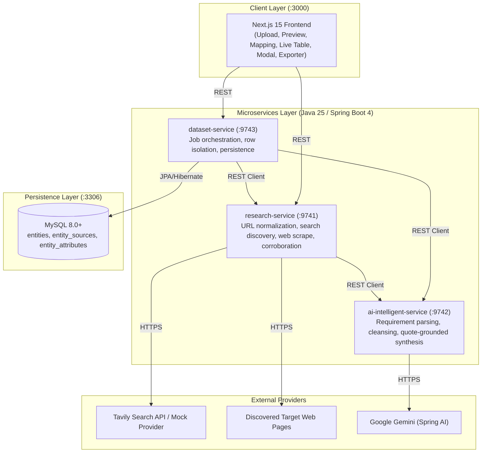

# V1 Baseline: Data Enrichment AI Intelligence Platform

> **Release**: `v1.0.0`  
> **Status**: Frozen Production Prototype  
> **Date**: September 2026  

---

## 1. Executive Summary

V1 delivers a working, end-to-end data enrichment platform that transforms sparse, noisy spreadsheet datasets (CSV/XLSX) into structured, evidence-grounded entity intelligence. The system operates on a 3-microservice Spring Boot architecture paired with a Next.js 15 client and a MySQL persistence store.

---

## 2. V1 Functional Flow

```
[CSV / XLSX Upload]
       ↓
[Dataset Preview & Type Detection]
       ↓
[Column Confirmation & Requirement Input]
       ↓
[Batch Job Submission / Synchronous Single Row]
       ↓
[Entity Normalization & URL Canonicalization]
       ↓
[Targeted Search Query Generation]
       ↓
[Multi-Source Web Discovery & Ranking]
       ↓
[HTML Fetching & Boilerplate Cleaning]
       ↓
[Verbatim Evidence Extraction]
       ↓
[AI-Assisted Grounded Synthesis & Normalization]
       ↓
[Multi-Source Corroboration & Confidence Scoring]
       ↓
[MySQL Persistence & Audit Catalog]
       ↓
[Non-Destructive CSV/XLSX Export]
```

---

## 3. V1 Architecture & Component Topology



---

## 4. Microservice Responsibilities in V1

### `dataset-service` (Port 9743)
- **Job Orchestration**: Asynchronous batch job execution with bounded `ThreadPoolExecutor`.
- **Row-Level Error Isolation**: Upstream scraping or network errors on an individual row are isolated (`status: FAILED`), allowing subsequent rows to proceed unhindered.
- **Single-Record Enrichment**: Synchronous `/api/v1/enrichment/single` for immediate row preview.
- **Persistence**: Relational storage of canonical entities, sources, and attributes in MySQL with Flyway migrations.

### `research-service` (Port 9741)
- **URL Normalization**: Canonicalizes international LinkedIn subdomains (`in.linkedin.com` $\rightarrow$ `linkedin.com`), removes tracking parameters, trims fragments.
- **Context-Aware Disambiguation**: Multi-signal matching across name, organization, role, location, and metadata.
- **Search Query Expansion**: Formulates boolean search queries leveraging entity metadata and parsed target fields.
- **Web Fetching & Cleaning**: Strips navigation, ads, and scripts; preserves dense textual content.
- **Multi-Source Corroboration**: Merges overlapping evidence, flags conflicting claims, and assigns confidence tiers (`HIGH`, `MEDIUM`, `LOW`).

### `ai-intelligent-service` (Port 9742)
- **Requirement Interpretation**: Converts natural language requests into structured `targetFields`, `focusAreas`, and `searchKeywords`.
- **Input Cleansing**: Strips honorifics, corporate suffixes, and emojis from seed names.
- **Evidence-Grounded Extraction**: Extracts attributes strictly backed by verbatim substrings from retrieved content.
- **Anti-Hallucination Guardrails**: Unknown or uncorroborated attributes return `"UNKNOWN"` or empty; inventing data is prohibited.
- **Value Normalization**: Reusable `AiOutputNormalizer` trims HTML tags, unifies `"UNKNOWN"` tokens, and deduplicates lists.

### `apps/frontend` (Port 3000)
- **5-Stage Workflow**: Upload $\rightarrow$ Preview $\rightarrow$ Column Mapping $\rightarrow$ Live Processing $\rightarrow$ Results & Export.
- **Requirement Guidance**: Suggestion chips and custom requirement prompt for user-directed extraction.
- **Evidence Transparency**: Confidence color dots, conflict alerts, and modal displaying exact supporting quotes.
- **Non-Destructive Exporter**: Preserves all uploaded columns and appends `Enriched_*` attributes to CSV/XLSX downloads.

---

## 5. V1 Verification Baseline

| Test Suite | Total Tests | Status |
| :--- | :--- | :--- |
| `research-service` | 127 | **127 / 127 Passed** (`BUILD SUCCESS`) |
| `ai-intelligent-service` | 11 | **11 / 11 Passed** (`BUILD SUCCESS`) |
| `dataset-service` | 7 | **7 / 7 Passed** (`BUILD SUCCESS`) |
| `apps/frontend` | Production Build | **0 TypeScript / Lint Errors** (`Exit code 0`) |
| Regression Sample | 5 records | Verified in `data/samples/v1-regression-dataset.csv` |
