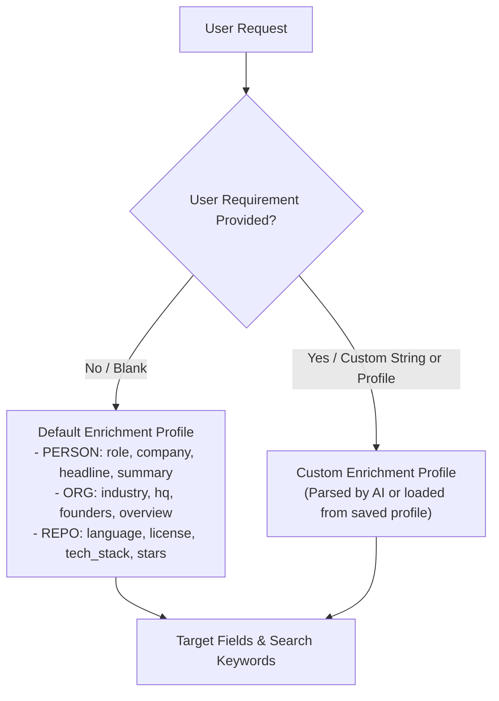

# V2 AI & Intelligence Architecture

> [!WARNING]
> **PROPOSED SPECIFICATION / NOT IMPLEMENTED YET**  
> Baseline: `v1.0.0` frozen release.

---

## 1. Core AI Philosophy: Zero Hallucination & Cost Consciousness

1. **AI is a Reasoning Engine, Not a Knowledge Store**: We never query the LLM for its pre-trained parametric knowledge (e.g., *"What is Stripe's funding?"*). The LLM is strictly used as an in-context synthesis engine over fetched, authoritative web text.
2. **Every Claim Must Be Grounded**: Every extracted fact attribute **must** have an accompanying `verbatimQuote` matching an exact substring in the retrieved text.
3. **Deterministic First, AI Second**: If a fact can be extracted via regex, CSS selector, or deterministic parser (e.g., GitHub stars, license, phone numbers), do not call an LLM.

---

## 2. The 5-Stage Intelligence Boundary

```mermaid
flowchart LR
    subgraph S1 ["Stage 1: Deterministic Preprocessing"]
        Clean["URL Canonicalizer &<br/>Seed String Normalizer"]
        Chunk["Dense Text Chunker &<br/>Token Budgeter"]
    end

    subgraph S2 ["Stage 2: Deterministic Research & Discovery"]
        Search["Targeted Boolean Discovery<br/>(Primary & Authoritative Domains)"]
        Scrape["Boilerplate Stripper &<br/>DOM Article Parser"]
    end

    subgraph S3 ["Stage 3: Grounded AI Reasoning"]
        Prompt["Strict JSON Schema Prompt<br/>(Spring AI ChatClient)"]
        Infer["Model Inference<br/>(Gemini / Local Ollama)"]
    end

    subgraph S4 ["Stage 4: Deterministic Post-Processing"]
        QuoteCheck["Verbatim Substring Check<br/>(Enforces exact citation match)"]
        Normalize["AiOutputNormalizer<br/>(UNIFY 'UNKNOWN', trim HTML)"]
    end

    subgraph S5 ["Stage 5: Multi-Source Corroboration"]
        Merge["Corroborate Evidence &<br/>Confidence Tier Calculation"]
    end

    S1 --> S2 --> S3 --> S4 --> S5
```



---

## 3. Where AI SHOULD NOT Be Used

To ensure maximum performance, determinism, and zero hallucination, AI is explicitly forbidden in the following pipeline stages:

| Pipeline Stage | Why AI Should NOT Be Used | Deterministic V2 Mechanism |
| :--- | :--- | :--- |
| **URL Canonicalization** | LLMs rewrite or corrupt query parameters and protocols. | `UrlNormalizer.java` (RFC-compliant URI parsing, international LinkedIn subdomain mapping, tracking token removal). |
| **Search Query Generation** | LLMs generate overly verbose queries that confuse search indexers. | `QueryBuilder.java` (Deterministic boolean combinations of `name + company + role + targetKeywords`). |
| **HTML Boilerplate Removal** | Passing raw HTML into LLMs wastes thousands of tokens. | Jsoup-based CSS selector stripping (`nav`, `footer`, `script`, `style`, `aside`). |
| **Verbatim Quote Verification** | LLMs hallucinate false confirmations of quotes. | Java `String.contains(quote)` substring search. If false, confidence is downgraded and attribute rejected. |
| **Deduplication** | LLMs are slow and non-deterministic for pairwise comparisons. | SHA-256 comparison keys and Levenshtein token-overlap metrics. |

---

## 4. User-Directed Enrichment vs Default Enrichment

V2 supports both **Default Enrichment** (system decides baseline fields) and **User-Directed Enrichment** (user customizes target attributes):



### Representation of Requirements
Requirements are modeled as an `EnrichmentProfile`:
```json
{
  "profileId": "profile-fintech-due-diligence",
  "name": "Fintech Due Diligence",
  "entityType": "ORGANIZATION",
  "targetFields": [
    {
      "key": "regulatory_licenses",
      "type": "LIST",
      "description": "Financial or banking licenses held (e.g. EMI, PI, Banking License)",
      "required": true
    },
    {
      "key": "primary_investors",
      "type": "LIST",
      "description": "Venture capital firms or lead investors"
    },
    {
      "key": "compliance_officer",
      "type": "STRING",
      "description": "Name of Chief Compliance Officer or MLRO"
    }
  ],
  "searchKeywords": ["regulatory license", "lead investors", "compliance officer"]
}
```

---

## 5. Token Budgeting & Cost Optimization

Scraped web content can easily exceed 20,000 words. Passing entire documents into LLMs degrades response latency and incurs substantial token costs.

### V2 Token Guard Strategy
1. **Paragraph Relevance Scoring**:
   Before passing scraped text to the LLM, `research-service` scores each paragraph against the target keywords.
   $$\text{Score}(P) = \sum_{w \in \text{keywords}} \text{Count}(w, P) \times \text{Weight}(w)$$
2. **Context Window Capping**:
   Only the top $K$ paragraphs (capped at 4,000 characters / $\approx 1,000$ tokens per source) are included in the prompt context.
3. **Structured Prompt Caching**:
   Common system instructions and schema definitions are fixed at the top of the prompt to maximize provider prompt caching hit rates.
4. **Usage Diagnostics**:
   Every response from `ai-intelligent-service` returns:
   ```json
   {
     "modelName": "gemini-2.5-flash",
     "promptTokens": 842,
     "completionTokens": 118,
     "inferenceDurationMs": 420
   }
   ```
