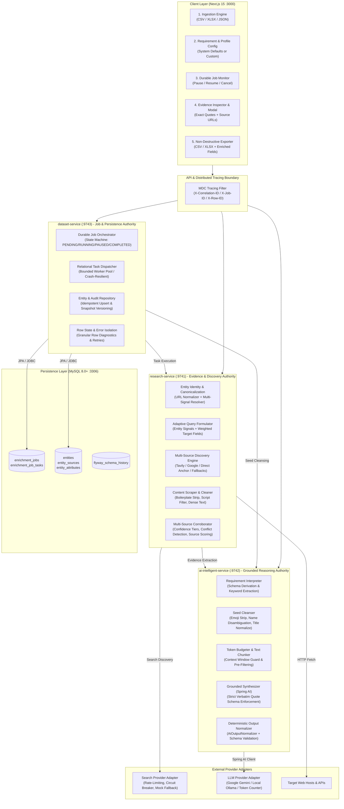
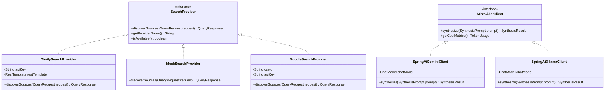

# V2 Architecture Evolution & System Blueprint

> [!WARNING]
> **PROPOSED ARCHITECTURE / NOT IMPLEMENTED YET**  
> Baseline: `v1.0.0` frozen release.

---

## 1. High-Level V2 Architecture Diagram

---

## 2. Structural Evolution: Current V1 vs Proposed V2

| Dimension | Current V1 Implementation | Proposed V2 Evolution |
| :--- | :--- | :--- |
| **Job State** | In-memory `ConcurrentHashMap<String, JobState>`. Terminated on restart. | Persistent MySQL tables (`enrichment_jobs`, `enrichment_job_tasks`). Crash-proof and restart-resilient. |
| **Row Concurrency** | Single bounded `ThreadPoolExecutor` without task cancellation. | Configurable worker pool with graceful cancellation tokens, pause/resume, and per-row retry counters. |
| **Data Models** | Monolithic `RowEnrichmentResult` carrying all intermediate states. | Decoupled domain models: `InputRecord` $\rightarrow$ `EntityIdentity` $\rightarrow$ `EvidenceDocument` $\rightarrow$ `EnrichedRecord`. |
| **Requirements** | Free-form natural language string passed down ad-hoc. | First-class `EnrichmentProfile` entity with named fields, validation types, and confidence thresholds. |
| **AI Extraction** | Direct text ingestion into Gemini with basic fallback. | Two-stage pipeline: Deterministic text pre-filtering + token budgeting $\rightarrow$ Spring AI extraction $\rightarrow$ schema validation. |
| **Evidence Audit** | Basic snippet string and source URL stored in entity attribute. | Full evidence provenance graph: HTTP status, crawl timestamp, domain authority score, exact quote, character offsets. |
| **Observability** | Standard Spring logging to console. | Unified MDC logging with `X-Correlation-ID`, `X-Job-ID`, and `X-Row-ID`, plus Prometheus actuator metrics. |
| **Pagination** | All row results returned in single HTTP response payload. | Standard keyset/offset pagination on `/api/v1/enrichment/jobs/{jobId}/results?page=0&size=50`. |

---

## 3. Microservice Roles & Strategic Boundaries in V2

### A. `dataset-service` (Port 9743)
* **Strategic Role**: **Job Lifecycle, Row Coordination, and Persistence Authority**
* **V2 Enhancements**:
  1. **Relational Task State**: Persists every row task into `enrichment_job_tasks` with state transitions: `PENDING` $\rightarrow$ `RUNNING` $\rightarrow$ `COMPLETED` / `PARTIAL` / `FAILED`.
  2. **Job Control Plane**: Supports `POST /jobs/{id}/pause`, `POST /jobs/{id}/resume`, and `POST /jobs/{id}/cancel`.
  3. **Batch Pagination**: Serves paginated results to protect UI and network bandwidth.
  4. **Entity Audit Catalog**: Manages historical snapshots, source citations, and deduplication keys in MySQL.

### B. `research-service` (Port 9741)
* **Strategic Role**: **Information Gathering, Discovery, and Evidence Corroboration**
* **V2 Enhancements**:
  1. **Adaptive Query Strategies**: Formulates prioritized multi-signal search queries balancing entity identity, employer, role, and user target fields.
  2. **Resilient Provider Adapters**: Encapsulates external search engines behind a unified `SearchProvider` interface with exponential backoff and rate-limit circuit breaking.
  3. **Multi-Source Corroborator**: Detects corroborating assertions, reconciles date discrepancies, flags conflicts, and scores source authority.
  4. **Dense Text Extraction**: Strips navigational DOM nodes, advertisements, and tracking scripts before passing clean text forward.

### C. `ai-intelligent-service` (Port 9742)
* **Strategic Role**: **Reasoning, Interpretation, and Grounded Synthesis Authority**
* **V2 Enhancements**:
  1. **Token Budgeting & Pre-Filtering**: Analyzes scraped content length and prunes irrelevant paragraphs before prompt construction, reducing LLM token consumption by up to $50\%$.
  2. **Strict Verbatim Enforcement**: Validates that every extracted fact value is a verbatim substring of the input text chunk.
  3. **Model & Cost Tracking**: Attaches execution metadata (`modelName`, `promptTokens`, `completionTokens`, `durationMs`) to every extraction response.
  4. **Standardized Normalization**: Applies `AiOutputNormalizer` across all extracted fields to enforce uniform `"UNKNOWN"` representations and clean formatted lists.

### D. `frontend` (Port 3000)
* **Strategic Role**: **User Guidance, Transparent Audit Inspection, and Safe Export**
* **V2 Enhancements**:
  1. **Job Control Controls**: Pause, resume, and cancel buttons directly in the active progress bar.
  2. **Virtual / Paginated Table**: Smooth rendering of 1,000+ rows without browser DOM throttling.
  3. **Filterable Results**: Filter rows by status (`COMPLETED`, `PARTIAL`, `FAILED`) or confidence level (`HIGH`, `MEDIUM`, `LOW`).
  4. **Deep Evidence Modal**: Shows side-by-side comparison of input seed, extracted attributes, supporting verbatim quote, and link to discovered primary source.

---

## 4. Provider Abstraction Strategy

To prevent vendor lock-in and enable seamless local testing:

1. **Search Providers**: `research-service` operates against `SearchProvider`. At runtime, Spring Boot loads `TavilySearchProvider` if `SEARCH_PROVIDER_NAME=tavily` and key is present, defaulting to `MockSearchProvider` for deterministic offline execution.
2. **AI Reasoning Providers**: `ai-intelligent-service` leverages Spring AI's native `ChatModel` interface, allowing plug-and-play transitions between Google Gemini, OpenAI, or local Ollama instances without rewriting prompt formatting logic.
