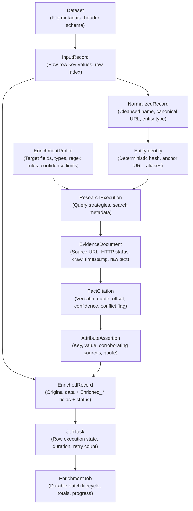

# V2 Data Model Evolution & Domain Architecture

> [!WARNING]
> **PROPOSED SPECIFICATION / NOT IMPLEMENTED YET**  
> Baseline: `v1.0.0` frozen release.

---

## 1. The Core Data Model Problem in V1

In V1, a single record `RowEnrichmentResult` acted as a "catch-all" data container:
- It held raw spreadsheet key-values.
- It held mapped column values.
- It held intermediate research responses.
- It held AI attributes.
- It held job status and diagnostic strings.

This coupling caused:
1. **Serialization bloat**: Large intermediate evidence strings were duplicated across in-memory state and JSON responses.
2. **Persistence ambiguity**: Updating an entity snapshot required reconstructing domain objects from DTOs.
3. **Immutability violations**: Modifying a row status during processing risked mutating earlier research metadata.

---

## 2. V2 Conceptual Domain Model

V2 strictly decouples data lifecycle stages into discrete, immutable domain concepts:



---

## 3. Detailed Entity Definitions

### 1. `InputRecord`
* **Role**: Preserves the exact, untampered raw row uploaded by the user.
* **Fields**:
  * `rowId` (UUID)
  * `rowIndex` (int)
  * `rawFields` (`Map<String, String>`)

### 2. `NormalizedRecord`
* **Role**: Standardized seed representation produced by `ai-intelligent-service` (`/api/v1/ai/clean`).
* **Fields**:
  * `displayName` (String: cleaned, emojis and corporate suffixes stripped)
  * `canonicalUrl` (String: normalized scheme, lowercased host, stripped tracking query parameters)
  * `entityType` (`PERSON`, `ORGANIZATION`, `PRODUCT`, `REPOSITORY`, `WEBSITE`, `OTHER`)
  * `contextAttributes` (`Map<String, String>`: employer, role, location extracted from seed)

### 3. `EntityIdentity`
* **Role**: The unique, persistent anchor representing a real-world entity.
* **Fields**:
  * `entityId` (SHA-256 deterministic hash computed from canonical URL or primary domain + normalized name)
  * `canonicalUrl` (String)
  * `primaryName` (String)
  * `aliases` (`Set<String>`)

### 4. `EvidenceDocument`
* **Role**: Immutable record of an external web source fetched during research.
* **Fields**:
  * `documentId` (UUID)
  * `sourceUrl` (String)
  * `domain` (String)
  * `sourceType` (`PRIMARY`, `SECONDARY`, `AGGREGATOR`)
  * `domainAuthority` (double: 0.0 to 1.0)
  * `httpStatus` (int)
  * `retrievedAt` (Instant)
  * `cleanTextContent` (String: dense text without boilerplate)

### 5. `FactCitation` & `AttributeAssertion`
* **Role**: Fine-grained factual claim grounded in an `EvidenceDocument`.
* **Fields**:
  * `attributeKey` (String: e.g. `tech_stack`, `founders`)
  * `attributeValue` (String: normalized fact value or `"UNKNOWN"`)
  * `verbatimQuote` (String: exact substring found in `EvidenceDocument`)
  * `quoteCharOffset` (int)
  * `confidence` (`HIGH`, `MEDIUM`, `LOW`)
  * `corroboratingSources` (`List<String>`)
  * `conflictDetected` (boolean)

### 6. `EnrichmentJob` & `JobTask`
* **Role**: Durable batch execution state machine managed in MySQL.
* **Fields (`EnrichmentJob`)**:
  * `jobId` (UUID)
  * `datasetName` (String)
  * `status` (`PENDING`, `RUNNING`, `PAUSED`, `COMPLETED`, `FAILED`, `CANCELLED`)
  * `totalRows` (int)
  * `completedRows` (int)
  * `failedRows` (int)
  * `progressPercentage` (int)
  * `startedAt` (Instant)
  * `completedAt` (Instant)
* **Fields (`JobTask`)**:
  * `taskId` (UUID)
  * `jobId` (UUID)
  * `rowIndex` (int)
  * `state` (`PENDING`, `RUNNING`, `COMPLETED`, `PARTIAL`, `FAILED`, `CANCELLED`)
  * `retryCount` (int)
  * `errorMessage` (String, nullable)
  * `durationMs` (long)

---

## 4. Relational Database Schema Evolution (Flyway `V3__`)

To support durable job execution, V2 introduces two relational tables to MySQL (`enrichment_db`):

```sql
-- Flyway V3__durable_job_orchestration.sql

CREATE TABLE enrichment_jobs (
    job_id VARCHAR(36) PRIMARY KEY,
    dataset_name VARCHAR(255) NOT NULL,
    profile_id VARCHAR(36) NULL,
    status VARCHAR(32) NOT NULL DEFAULT 'PENDING',
    total_rows INT NOT NULL DEFAULT 0,
    completed_rows INT NOT NULL DEFAULT 0,
    failed_rows INT NOT NULL DEFAULT 0,
    concurrency_limit INT NOT NULL DEFAULT 4,
    created_at TIMESTAMP NOT NULL DEFAULT CURRENT_TIMESTAMP,
    started_at TIMESTAMP NULL,
    completed_at TIMESTAMP NULL,
    error_message TEXT NULL,
    INDEX idx_jobs_status (status),
    INDEX idx_jobs_created (created_at)
) ENGINE=InnoDB DEFAULT CHARSET=utf8mb4 COLLATE=utf8mb4_unicode_ci;

CREATE TABLE enrichment_job_tasks (
    task_id VARCHAR(36) PRIMARY KEY,
    job_id VARCHAR(36) NOT NULL,
    row_index INT NOT NULL,
    status VARCHAR(32) NOT NULL DEFAULT 'PENDING',
    raw_input_json JSON NOT NULL,
    entity_id VARCHAR(64) NULL,
    result_json JSON NULL,
    retry_count INT NOT NULL DEFAULT 0,
    duration_ms BIGINT NULL,
    error_message TEXT NULL,
    updated_at TIMESTAMP NOT NULL DEFAULT CURRENT_TIMESTAMP ON UPDATE CURRENT_TIMESTAMP,
    CONSTRAINT fk_task_job FOREIGN KEY (job_id) REFERENCES enrichment_jobs(job_id) ON DELETE CASCADE,
    UNIQUE KEY uk_job_row (job_id, row_index),
    INDEX idx_task_status (job_id, status)
) ENGINE=InnoDB DEFAULT CHARSET=utf8mb4 COLLATE=utf8mb4_unicode_ci;
```

### Storage Efficiency & Deduplication
- `cleanTextContent` from large scraped pages is **NOT** persisted into the relational database. Only the exact supporting `verbatimQuote` (typically 50–200 characters) and source URL are stored. This keeps database table size compact and prevents GB-level database bloat.
