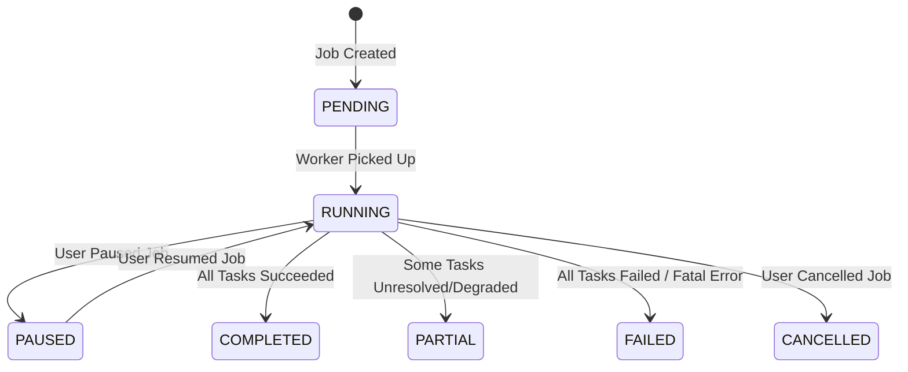
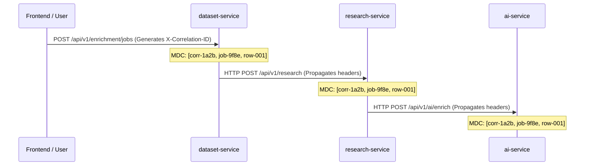

# V2 Reliability, Resilience, Observability & Security

> [!WARNING]
> **PROPOSED SPECIFICATION / NOT IMPLEMENTED YET**  
> Baseline: `v1.0.0` frozen release.

---

## 1. Durable Job Orchestration & Worker Model

### Relational Task Dispatcher (No Message Broker Required)
V1 held active batch job state in a Java `ConcurrentHashMap`. If the process terminated, running batches were lost.

In V2, batch jobs are persisted in MySQL (`enrichment_jobs` and `enrichment_job_tasks`). A bounded Spring thread pool (`ThreadPoolTaskExecutor`) processes tasks.



### When Would a Message Broker (RabbitMQ / Kafka) Be Justified?
* **Current Relational Model is Sufficient For**:
  * Batch sizes between 1 and 10,000 rows.
  * Concurrency of 1 to 50 parallel worker threads across 1–3 service instances.
  * Complete crash durability, pause/resume, and row-level retry.
* **The Threshold for a Dedicated Broker (Kafka / RabbitMQ)**:
  1. Throughput exceeding **500 rows/second sustained**.
  2. Multi-region cluster deployments with hundreds of distributed worker nodes.
  3. Strict event-sourcing and audit replay requirements spanning months.
  * **V2 Ruling**: **Reject Kafka/RabbitMQ.** Premature distributed brokers add operational overhead without improving enrichment accuracy.

---

## 2. Configuration vs Requirements vs Business Logic

To keep the platform flexible and avoid code recompilation for operational adjustments, V2 enforces strict separation across three layers:

```
┌─────────────────────────────────────────────────────────────┐
│ 1. SYSTEM CONFIGURATION (application.yml / Environment)     │
│    - Thread pool size, HTTP timeouts, max file upload size  │
│    - API keys (Tavily, Gemini), provider selection          │
├─────────────────────────────────────────────────────────────┤
│ 2. USER REQUIREMENTS (Per Job / Enrichment Profile)         │
│    - Target field names (e.g. "tech_stack", "founders")     │
│    - Domain scope, focus areas, entity type override        │
├─────────────────────────────────────────────────────────────┤
│ 3. CORE BUSINESS LOGIC (Java Service Code)                  │
│    - Zero-hallucination verbatim quote verification         │
│    - Confidence tier calculation, conflict detection        │
└─────────────────────────────────────────────────────────────┘
```

---

## 3. Resilience & Fault Tolerance Matrix

| Failure Mode | Impact on V1 | V2 Fault-Tolerant Resolution |
| :--- | :--- | :--- |
| **Search Provider 429 (Rate Limit)** | Search immediately crashes or degrades to empty. | Token-bucket rate limiter + automatic exponential backoff (1s, 2s, 4s) + fallback to Mock provider. |
| **Target Website 504 / Hangs** | Can block scraping thread for up to 10 seconds. | Strict connection timeout (2000ms) and read timeout (3000ms). Failure marked `SOURCE_UNAVAILABLE`. |
| **LLM Provider Outage** | Batch row fails with upstream error. | Offline deterministic heuristic extraction triggers automatically, marking confidence `LOW` rather than failing. |
| **Single-Row Exception** | Row isolated, but no retry. | Row task retried up to 2 times with jitter before marking status `FAILED`. Rest of batch continues. |
| **Process Crash mid-batch** | Job lost forever. | On restart, `dataset-service` finds tasks in `RUNNING` state older than heartbeat threshold (5 min) and resets them to `PENDING`. |

---

## 4. Distributed Tracing & Observability (MDC)

V2 introduces unified Mapped Diagnostic Context (MDC) logging across all 3 microservices:



### Key Prometheus Metrics (Spring Boot Actuator)
* `enrichment.job.duration`: Timer measuring total batch duration.
* `enrichment.row.status`: Counter tagged by `status=COMPLETED|PARTIAL|FAILED`.
* `research.fetch.duration`: Timer measuring web scrape latency per domain.
* `ai.token.usage`: Counter tagged by `type=prompt|completion` and `model=gemini-2.5-flash`.

---

## 5. Security Baseline

1. **Server-Side Request Forgery (SSRF) Protection**:
   * `research-service` validates that all scraped URLs resolve to public IP addresses, rejecting `127.0.0.1`, `10.0.0.0/8`, `192.168.0.0/16`, and cloud metadata endpoints (`169.254.169.254`).
2. **Spreadsheet Ingestion Safeguards**:
   * Maximum uploaded file size: **25 MB**.
   * Maximum row limit per batch: **5,000 rows**.
   * Sanitizes spreadsheet formula injection (strips leading `=`, `+`, `-`, `@` characters from cells).
3. **Indirect Prompt Injection Defense**:
   * Untrusted web content is enclosed in strict prompt boundaries:
     ```
     <scraped_web_content>
     [Scraped text here]
     </scraped_web_content>
     ```
   * System prompt explicitly instructs the LLM to ignore any instructions, directives, or system prompts found inside `<scraped_web_content>`.

---

## 6. Measurable V2 Performance Targets

| Metric | V1 Current Reality | V2 Engineering Target |
| :--- | :--- | :--- |
| **Max Batch Size** | 100 rows reliably | **1,000 to 5,000 rows** per batch |
| **Row Latency (Live Search + AI)** | 3.5 – 6.0 seconds / row | **1.8 – 2.8 seconds / row** (via parallel fetching & paragraph pre-filtering) |
| **Batch Concurrency** | 1 active job, 2 worker threads | **Up to 10 concurrent jobs, 20 parallel worker threads** |
| **Job Crash Recovery** | 0% (Wiped from memory) | **100% Resumable** from last completed row |
| **Acceptable Row Failure Rate** | Isolated, but unretried | **$< 2\%$ unrecoverable row failures** on valid inputs |
