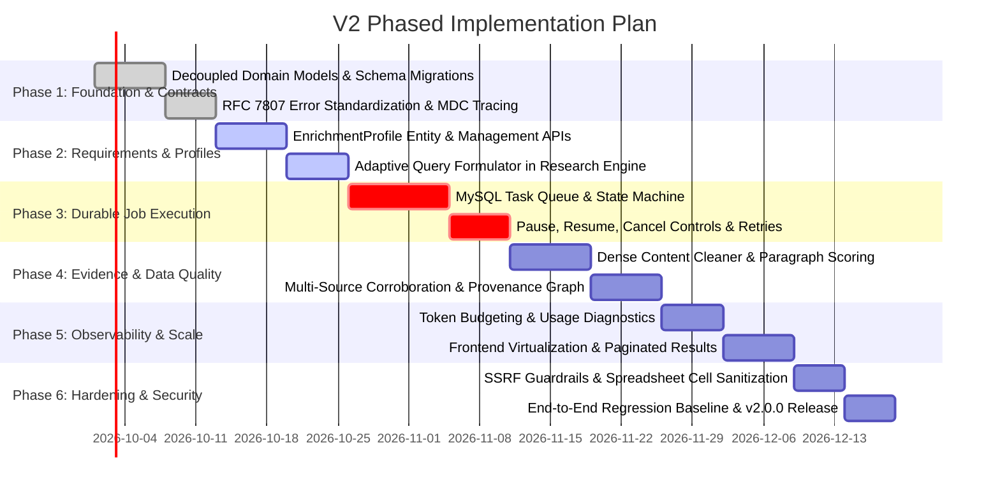

# V2 Phased Engineering Roadmap

> [!WARNING]
> **PROPOSED SPECIFICATION / NOT IMPLEMENTED YET**  
> Baseline: `v1.0.0` frozen release.

---

## 1. Roadmap Overview

The V2 evolution is structured into six deliberate, progressive phases to guarantee that the system remains continuously deployable and testable without parallel rewrites or architectural churn.

---

## 2. Phase Breakdown

### Phase 1: Foundation & Contracts
* **Objective**: Decouple domain models, formalize inter-service contracts, and establish distributed tracing without altering pipeline behavior.
* **Major Tasks**:
  1. Decouple monolithic `RowEnrichmentResult` into `InputRecord`, `NormalizedRecord`, `EntityIdentity`, and `AttributeAssertion`.
  2. Implement Spring Web filter for unified MDC logging (`X-Correlation-ID`, `X-Job-ID`, `X-Row-ID`).
  3. Standardize API error handling with RFC 7807 `application/problem+json`.
* **Dependencies**: None (Operates directly on frozen V1 codebase).
* **Expected Outcome**: Clean domain separation, zero serialization bloat, and traceable logs across all 3 services.

---

### Phase 2: Enrichment Requirements & Profiles
* **Objective**: Move from ad-hoc natural language strings to first-class, reusable enrichment profiles with typed validation.
* **Major Tasks**:
  1. Create `EnrichmentProfile` entity with named fields, data types, and priority search keywords.
  2. Implement profile management endpoints (`GET /api/v1/profiles`, `POST /api/v1/profiles`).
  3. Update `QueryBuilder` to weight search queries based on profile target fields.
  4. Add profile selector and custom schema editor to Next.js frontend.
* **Dependencies**: Phase 1 (Decoupled models).
* **Expected Outcome**: Predictable, user-directed enrichment with repeatable schema definitions.

---

### Phase 3: Durable Job Execution & Reliability
* **Objective**: Replace ephemeral in-memory job maps with persistent relational task management.
* **Major Tasks**:
  1. Add Flyway migration `V3__durable_job_orchestration.sql` creating `enrichment_jobs` and `enrichment_job_tasks`.
  2. Implement database-backed task state machine with crash recovery on service restart.
  3. Implement job control endpoints (`/pause`, `/resume`, `/cancel`).
  4. Implement per-row retry mechanism with exponential backoff for transient network errors.
* **Dependencies**: Phase 1 (Schema boundaries).
* **Expected Outcome**: 100% resumable batch execution; zero job loss on server reboot.

---

### Phase 4: Research & Evidence Quality
* **Objective**: Maximize evidence density and factual reliability while reducing LLM token waste.
* **Major Tasks**:
  1. Refactor `SourceProcessor` to score and extract only top relevant paragraphs matching target keywords.
  2. Implement strict character-offset tracking for verbatim quotes.
  3. Enhance multi-source corroboration to resolve conflicting temporal facts (e.g. current vs past employment).
  4. Add domain authority scoring to down-rank content scrapers and syndicators.
* **Dependencies**: Phase 2 (Profile target keywords).
* **Expected Outcome**: Higher accuracy facts, transparent quote auditability, and $\approx 50\%$ lower LLM token usage.

---

### Phase 5: Observability, Performance & Scale
* **Objective**: Prepare the platform for high-throughput batches (up to 5,000 rows) with full operational metrics.
* **Major Tasks**:
  1. Implement Spring Boot Actuator Prometheus metrics for row processing duration, search latency, and LLM token usage.
  2. Implement paginated row retrieval on `GET /api/v1/enrichment/jobs/{jobId}`.
  3. Update frontend with virtualized table rendering and filterable status views.
  4. Implement completion webhooks (`webhookUrl`).
* **Dependencies**: Phase 3 (Durable job persistence).
* **Expected Outcome**: Smooth UI performance on 1,000+ row files and real-time operational visibility.

---

### Phase 6: Production Hardening, Security & Release
* **Objective**: Harden security perimeter, run full regression testing against `v1-regression-dataset.csv`, and release V2.
* **Major Tasks**:
  1. Implement SSRF IP validation on all outbound HTTP scraping requests.
  2. Implement spreadsheet formula injection sanitization.
  3. Execute full regression test suite across mock and live providers.
  4. Create `v2.0.0` release tag and publish final user documentation.
* **Dependencies**: Phases 1 through 5.
* **Expected Outcome**: Enterprise-grade, hardened data enrichment platform ready for production deployment.
